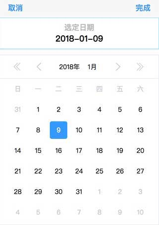
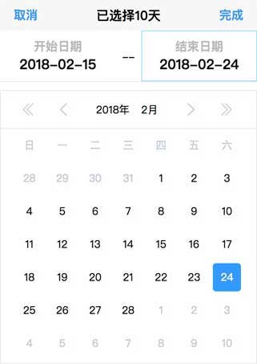

# mobile-input-date

> Date Input For Mobile

## Build Setup

```
# install dependencies
npm install

# develop env , example.js
npm run dev
# generate example.js
npm run build

# generate MobileInputDate.js & MobileInputDate.min.js
npm run prod
```

## example images




# Usage

### Include

- browser

```
<script type="text/javascript" src="MobileInputDate.js"></script>

<script type="text/javascript" src="MobileInputDate.min.js"></script>
```

- node

```
npm install vue-mobile-input-date

import MobileInputDate from 'vue-mobile-input-date';

Vue.use(MobileInputDate, {
    name: 'ComName'  // default 'MobileInputDate'
});
```

### usage

#### `option`

- `limit.start` date select start this day, value mode is 'yyyy-mm-dd'
- `limit.end` date select end this day, value mode is 'yyyy-mm-dd'

- `isRange` is `false`, is Date Select normal mode.

result is object have props: `oneDate`

- `isRange` is `true`, is Date Select range mode.

result is object have props: `startDate`,`endDate`


- component mode, must `visible` to display component
```
<template>
    <MobileInputDate v-model="midData"/>
    <button @click="midData.visible = true">component mode</button>
</template>

<script>
import Vue from 'Vue';
import MobileInputDate from 'MobileInputDate';

Vue.use(MobileInputDate);


// 1. isRange is false

export default {
    name: 'App',
    data() {
        return {
            midData: {
                visible: false,
                isRange: false,
                oneDate: '2018-1-9'
            }
        }
    },
    watch: {
        oneDate() {
            // do something ...
            doSth(this.oneDate);  // '2017-09-16'
        }
    }
};

// 2. isRange is true

export default {
    name: 'App',
    data() {
        return {
            midData: {
                visible: false,
                isRange: true,
                startDate: '2013-6-23',
                endDate: '2013-6-23',
            }
        }
    },
    watch: {
        // or endDate
        startDate() {
            // do something ...
            doSth1(this.startDate);  // '2017-09-18'
            doSth2(this.endDate);  // '2017-09-18'
        }
    }
};
<script>
```


- Global/Instance mode, return `Promise`
```
<template>
    <button @click="openDate">Global/Instance mode</button>
</template>

<script>
import Vue from 'Vue';
import MobileInputDate from 'MobileInputDate';

Vue.use(MobileInputDate);


export default {
    name: 'App',
    methods: {
        openDate() {
            // Vue.MobileInputDate
            this.$MobileInputDate({
                isRange: true,
                startDate: '',
                endDate: '',
                oneDate: '',
                limit: {
                    start: '2010-10-9',
                    end: '2020-6-21'
                }
            }).then((d) => {
                // 1. isRange is false

                /*
                d is :
                {
                    oneDate: '2017-09-16'
                }
                */

                // 2. isRange is true

                /*
                d is :
                {
                    startDate: '2017-09-18',
                    endDate: '2017-11-08'
                }
                */
            });
        }
    }
};
<script>
```
